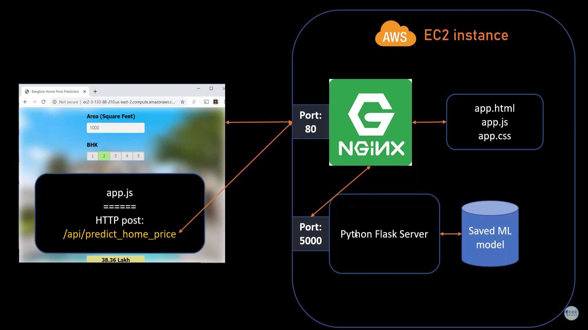
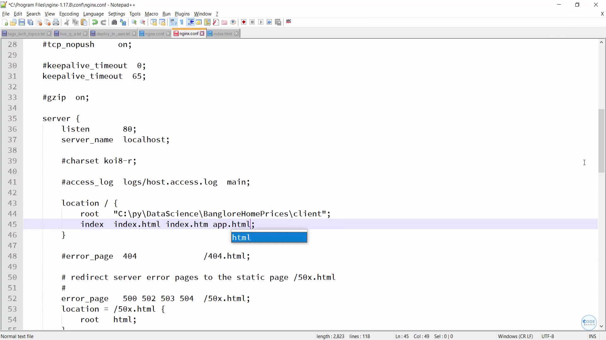
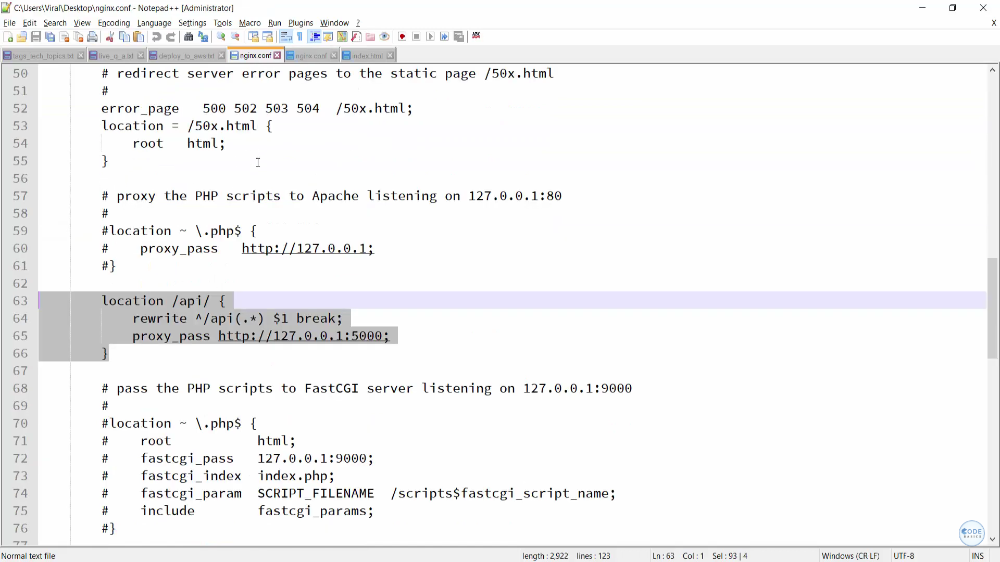

# Server Code

# Testing api resquests in postman
## Get Method: getting location

---
## Post Method: getting estimated price
* Input: total_sqft,location, bath, bhk in body

--- 

# Deploy machine learning model to production nginx

changes in ngix.conf

# Deploy machine learning model to production AWS (Amazon EC2 instance)

https://youtu.be/q8NOmLD5pTU?si=fJhWzLoig6xQeL5a